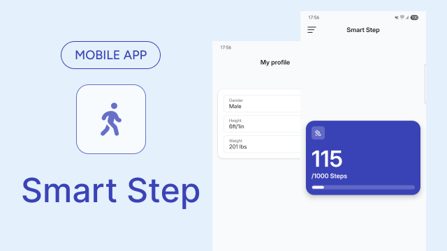
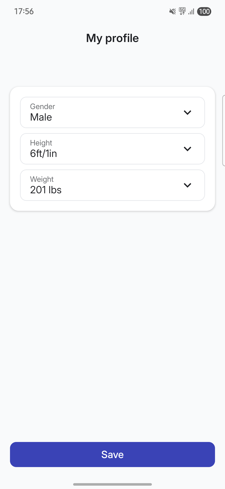
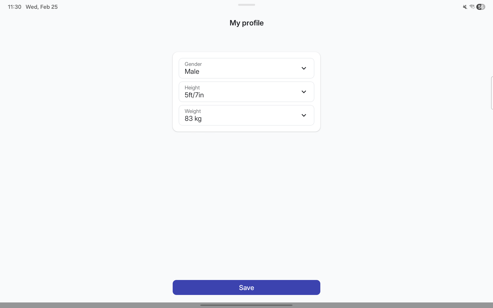
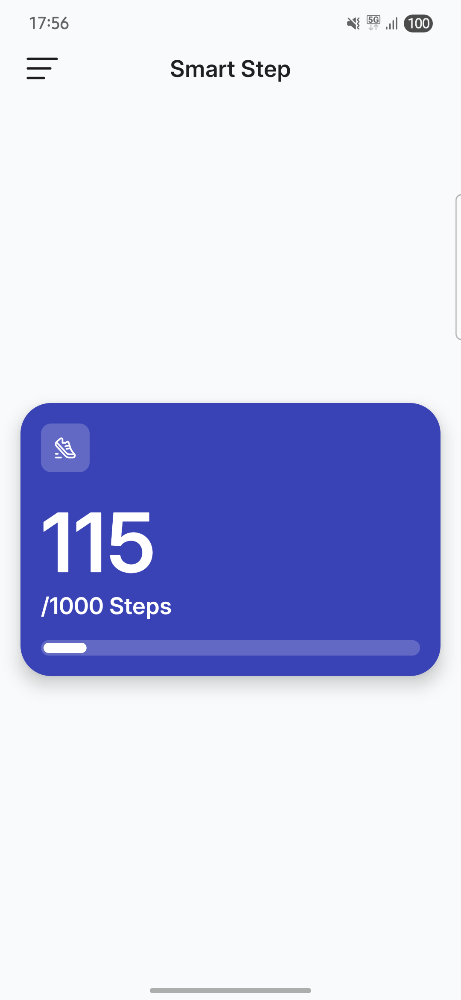
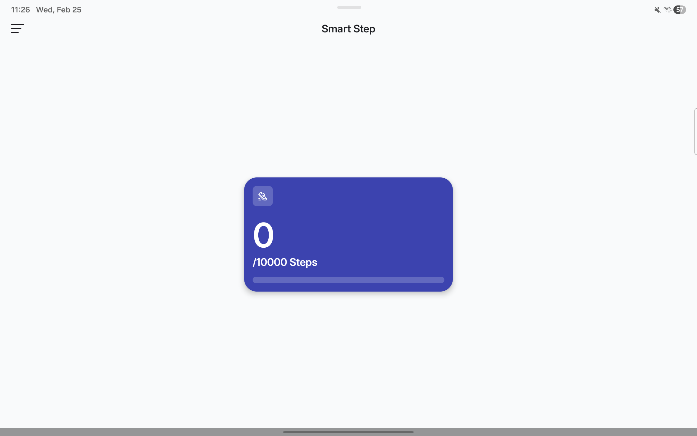

## Project Status

This project is divided in 4 different milestones that are launched every fortnight. 

Current status: **Milestone 1 finished**

### 🚨 Latest Features ###

- **Personal Settings Screen**
  - Showed as on boarding and in navigation drawer.
  - Wheel picker design and implementation.
  - User preferences:
    - Weight selection as kilograms or pounds.
    - Height selection as cm or feet and inches.
    - Gender selection.
  - Local persistence.

- **Home Screen**
  - Sensors and background access permissions flow.
  - Navigation drawer with fix step counter issue, personal settings, step goal, and exit options.  
  - Steps counter.

## 🧑🏽‍💻 Technical implementation

- ✅ Android Gradle Plugin 9.
- ✅ Compose Navigation 3.
- ✅ Koin dependency injection.
- ✅ JUnit5 for testing.
- ✅ Jacoco for code coverage.
- ✅ DataStore for preferences.

## 🎥 Demo ##

https://github.com/user-attachments/assets/66e66f8a-d863-42c2-99a9-44e03e40d443

## 📱 Screenshots ##

  
Personal Settings

| Mobile                                                                                    | Tablet                                                                                     | 
|-------------------------------------------------------------------------------------------|--------------------------------------------------------------------------------------------|
|  |  |

  
Home

| Mobile                                                           | Tablet                                                            | 
|------------------------------------------------------------------|-------------------------------------------------------------------|
|  |  |

## 🪪 License

This project is an open-source and free to use. Feel free to fork and upload your commits.

## Acknowledge

- Compose Navigation 3 for the first time.
- Exploring AGP 9.
- Mastering dependency injection with Koin.
- Step Counter Manager.
- 80% ⬆ testing coverage.