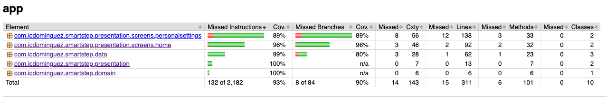

**SmartStep** is a fitness Android application designed to track daily steps using the device sensors while adapting the experience to the user's personal data.

During the onboarding process, the app collects basic information such as gender, weight, and height in order to personalize the tracking experience. The application continuously monitors step activity and requests background sensor access so that step counting remains active even when the app is not in use.

The goal of the app is to provide a simple and reliable step tracking experience while exploring modern Android development tools such as Jetpack Compose, Koin, and automated testing.

## Project Status

This project is divided in 4 different milestones that are launched every fortnight. 

Current status: **Milestone 1 finished**

### 🚨 Latest Features ###

- **Personal Settings Screen**
  - Showed as on boarding and in navigation drawer.
  - Wheel picker design and implementation.
  - User preferences:
    - Weight selection as kilograms or pounds.
    - Height selection as cm or feet and inches.
    - Gender selection.
  - Local persistence.

- **Home Screen**
  - Sensors and background access permissions flow.
  - Navigation drawer with fix step counter issue, personal settings, step goal, and exit options.  
  - Steps counter.

## 🧑🏽‍💻 Technical implementation

- ✅ Android Gradle Plugin 9.
- ✅ Compose Navigation 3.
- ✅ Koin dependency injection.
- ✅ JUnit5 for testing.
- ✅ Jacoco for code coverage.
- ✅ DataStore for preferences.

## 🧪 Testing & Code Coverage

This project was built with a strong focus on testing from the beginning.
Unit tests are written using **JUnit5**, and **JaCoCo** is used to measure the test coverage.

Current coverage is **80%+**, ensuring that most of the core logic is validated through automated tests.

| JaCoCo coverage report for the SmartStep app module         |
|-------------------------------------------------------------|
|  |

## 🎥 Demo ##

https://github.com/user-attachments/assets/66e66f8a-d863-42c2-99a9-44e03e40d443

## 📱 Screenshots ##

  
Personal Settings

| Mobile                                                                                    | Tablet                                                                                     | 
|-------------------------------------------------------------------------------------------|--------------------------------------------------------------------------------------------|
|  |  |

  
Home

| Mobile                                                           | Tablet                                                            | 
|------------------------------------------------------------------|-------------------------------------------------------------------|
|  |  |

## 🪪 License

This project is an open-source and free to use. Feel free to fork and upload your commits.

## What I explored in this project

- Compose Navigation 3 for the first time.
- Exploring AGP 9.
- Mastering dependency injection with Koin.
- Step Counter Manager.
- 80% ⬆ testing coverage.